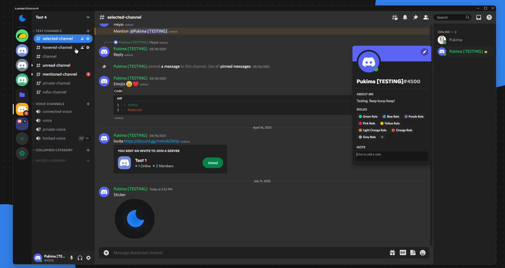
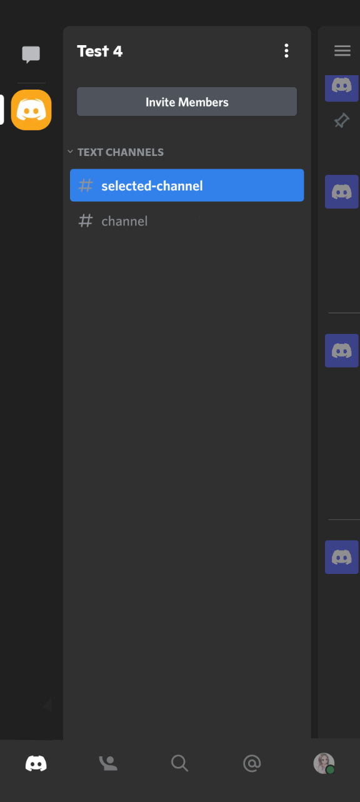

    
    <h2 align="center">Lunar for Discord</h2>

A minimal black and blue color scheme inspired by space 🚀

## Usage
### Aliucord (Android)
1. Download the [Themer Plugin](https://github.com/Vendicated/AliucordPlugins/raw/builds/Themer.zip)
2. Place the plugin `/storage/emulated/0/Aliucord/plugins`
3. Download [this file](https://lunar-theme.github.io/discord/lunar.aliucord.json) (`ctrl` + `s` on the site)
4. Place the theme into `/storage/emulated/0/Aliucord/themes`
5. Restart your Aliucord to see the changes

### BetterDiscord
1. Download [this file](https://lunar-theme.github.io/discord/lunar.theme.css) (`ctrl` + `s` on the site)
2. Place the file into:
    - Windows: `%AppData%\betterdiscord\themes`
    - Linux: `~/.config/BetterDiscord/themes`
    - Mac: `~/Library/Application Support/betterdiscord/themes`
3. In Discord go into `Usersettings > Themes` and activate *Lunar*

### GooseMod
Use their store

### Powercord
*Replace lowercase `powercord` with your path to powercord (where you cloned their repo)*
1. `cd powercord/src/Powercord/themes`
2. `git clone https://github.com/lunar-theme/discord`
3. Restart your client

### Vizality
*Replace `vizality` with your path to Vizality (where you cloned their repo)*
1. `cd vizality/addons/themes`
2. `git clone https://github.com/lunar-theme/discord`
3. Restart your client

## Gallery
<table>
<td align="center" style="padding=0;width=50%;">Desktop</td>
<td align="center" style="padding=0;width=50%;">Aliucord (Mobile)</td>
</table>

## Team

This theme is maintained by the following person(s) and a bunch of [awesome contributors](https://github.com/lunar-theme/discord/graphs/contributors).

 |
--- |
|[Pukimaa](https://github.com/Pukimaa) |
